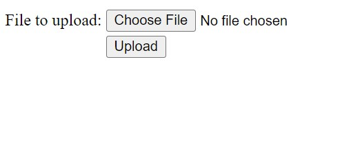
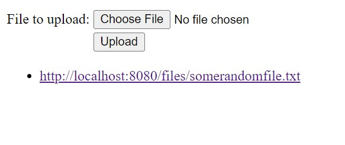

# File Storage Service Implementation in Java - Project Documentation

## Overview
This document provides an overview of the File Storage Service project. The project is developed using the `spring-boot-web` and `spring-boot-thymeleaf` frameworks, facilitating a web-based interface for file storage and retrieval.

Objective: To deliver a reliable and efficient file storage service with an emphasis on simplicity and functionality.

## Features
- **File Upload Functionality**: The service allows for the uploading of files to a server via a web interface.
- **Directory Specification**: Users have the option to specify the directory for file storage. The default location is the 'upload-dir' in the project's root directory.
- **Downloadable Links**: Each file upload generates a link, allowing for easy retrieval of the file.

## Future Developments
- **Duplicate File Handling**: Implementation is underway to enable the storage of files with duplicate names by appending a numerical identifier before the file extension.
- **File Management Improvements**: Planned upgrades include enhanced capabilities for file sorting, searching, and categorization.

## Screenshots
- Welcome screen

- File select, upload, and get success message:

- File perists on the server:

## Contribution Guidelines
Contributions to this project are subject to review and approval. Interested parties are encouraged to submit feature requests, bug reports, and pull requests through the project's GitHub repository.

## Licensing
This project is released under the MIT License. The full license terms are available in the [LICENSE](LICENSE) file. Usage, modification, and distribution of the project are permitted within the bounds of this license.
